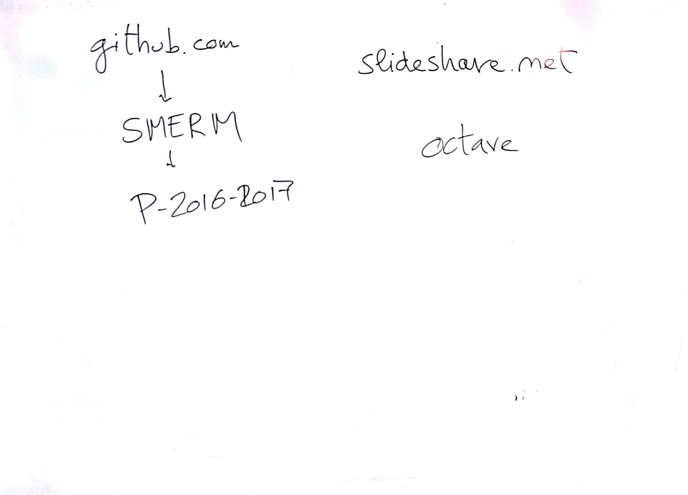

# Lezione di giovedì 1 dicembre 2016

## Argomenti Trattati

* Presentazione del corso: suddivisione
  |giovedì|lunedì|martedì
  |:---:|:---:|:---:|
  |TCMC|informatica|matematica
* strumenti per l'informatica:
  * linux: terminal tools
  * mac:   terminal tools
  * windows: djgpp o derivati
* social:
  [github](https://github.com/SMERM/P-2016-2017)
  [gitter](https://gitter.mi/SMERM/smerm.github.io)
* slides TCMC:
  [slides](http://www.slideshare.net/NicolaBernardini2/tecniche-compositive-della-musica-contemporanea)
* strumenti per la parte matematica:
  [octave](http://www.gnu.org/software/octave/)
* Introduzione alle funzioni della musica:
  * rituale
  * intrattenimento
  * speculativa
* modifiche sulla speculazione musicale legate alla riproducibilità dei suoni (fine ottocento)
* [slides](http://www.slideshare.net/NicolaBernardini2/tecniche-compositive-della-musica-contemporanea) 1-10: il contesto storico del periodo in esame (la prima metà del '900)
