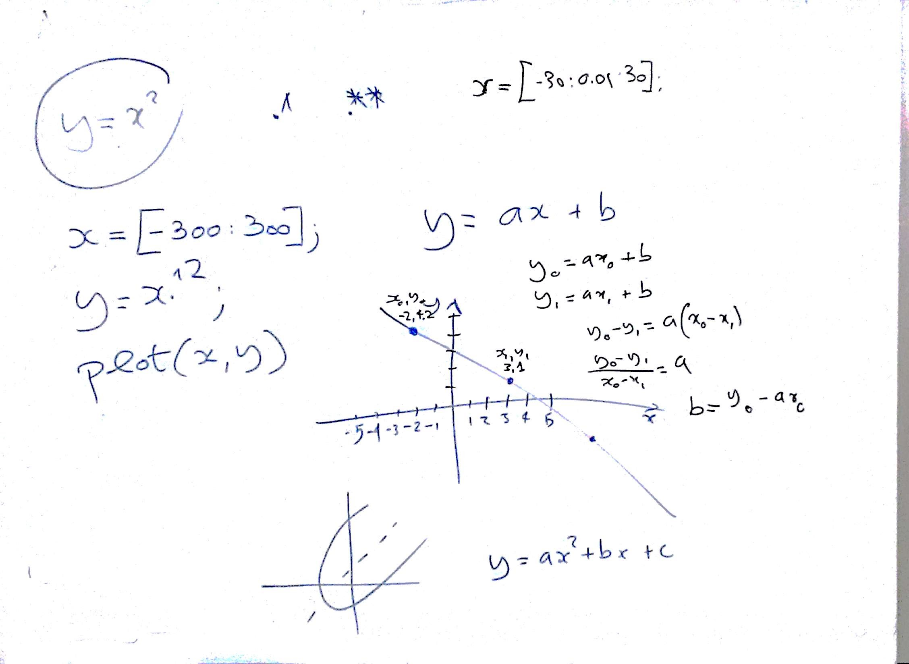

# Lezione di giovedì 19 dicembre 2016 (Matematica)

## Argomenti trattati

* Come far passare una funzione lineare da due punti
  * sistema di equazioni
  * operazioni su sistemi di equazioni
  * verifica del funzionamento attraverso un programma scritto in *Octave*
  * introduzioni a funzioni di grado superiore: le parabole
