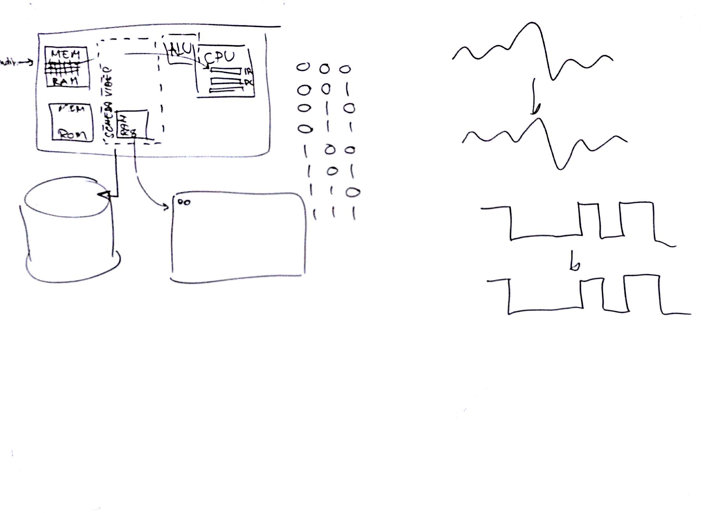

# Lezione di martedì 20 dicembre 2016 (Informatica)

## Argomenti trattati

* Che tipo di informatica serve alla musica elettronica?
  * visione professionale - non consueta - dello strumento
  * conoscenza approfondita dell'hardware e del software
* Verifica delle conoscenze hardware:
  * *motherboard*
  * memoria *RAM*
  * memoria *ROM*
  * *CPU*
  * scheda video
  * disco rigido
  * numerazione binaria
