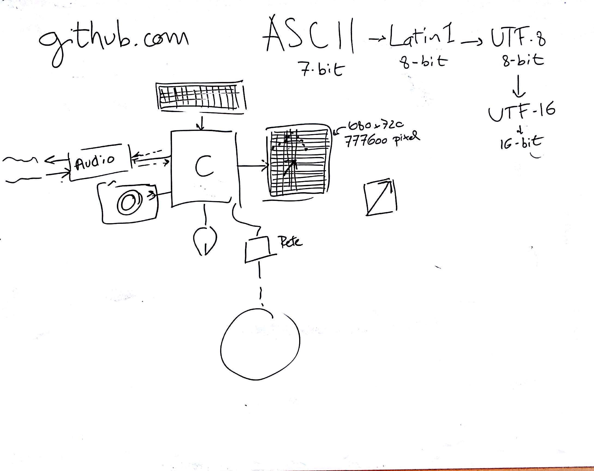

# Lezione di martedì 10 gennaio 2017 (Informatica)

## Argomenti trattati

* La comunicazione del computer con l'esterno - le interfacce:
  * la tastiera
    * codifica ASCII
    * codifica UTF-8
    * ulteriori codifiche (Latin1, UTF-16, ecc.)
  * il video
    * codifica dei caratteri
    * codifica dei *pixels*
    * codifica dei colori
  * la scheda audio
    * introduzione alla codifica dei suoni
  * il mouse
    * codifica incrementale della posizione
    * lo *sprite* sullo schermo
