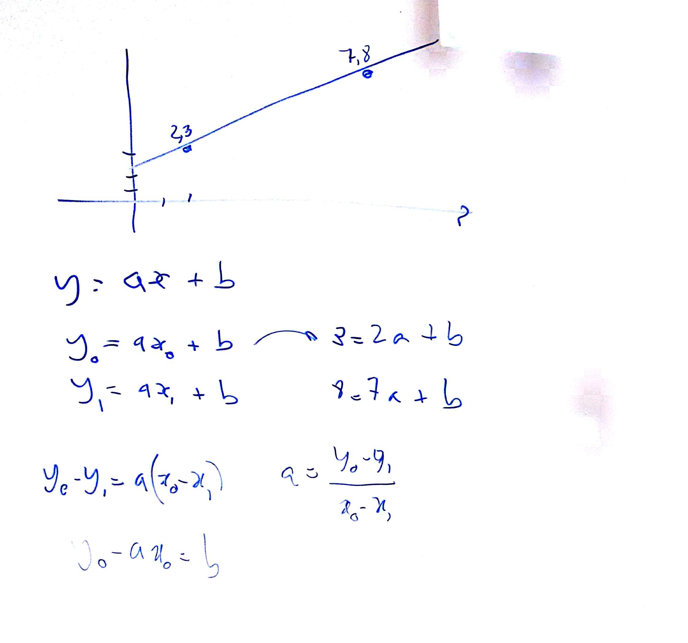
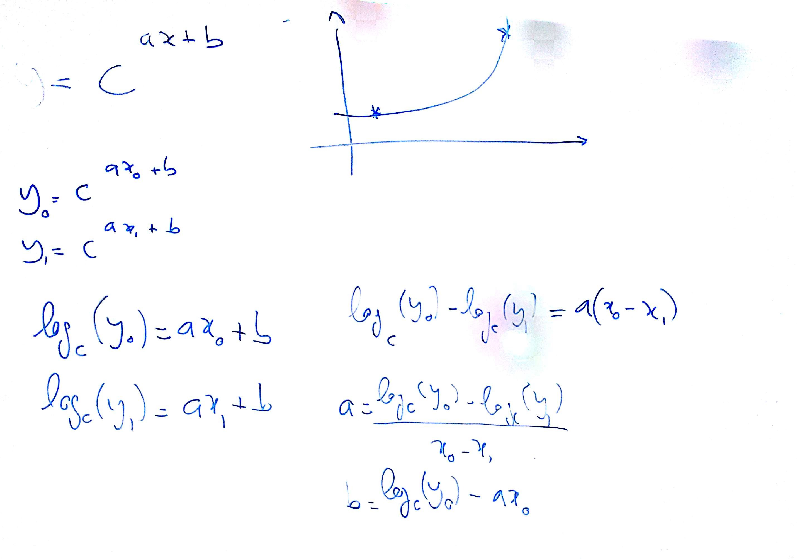
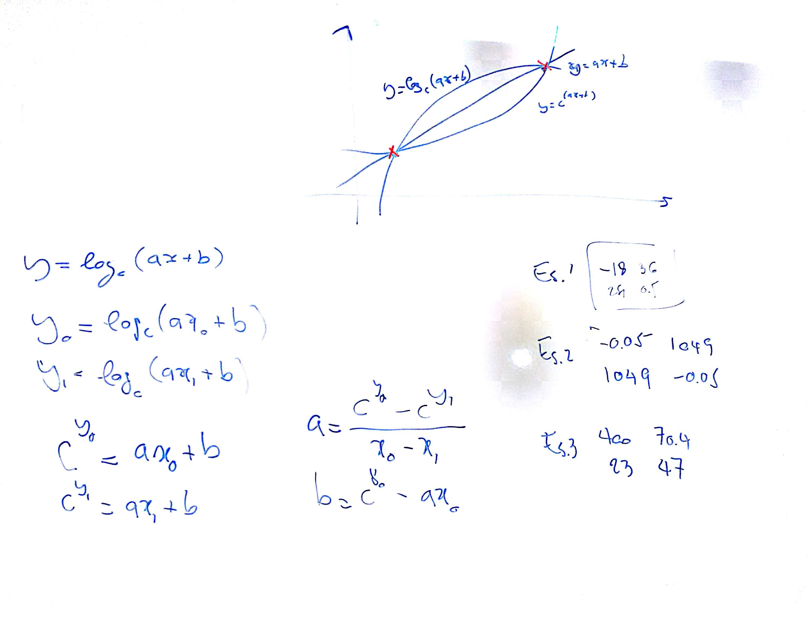
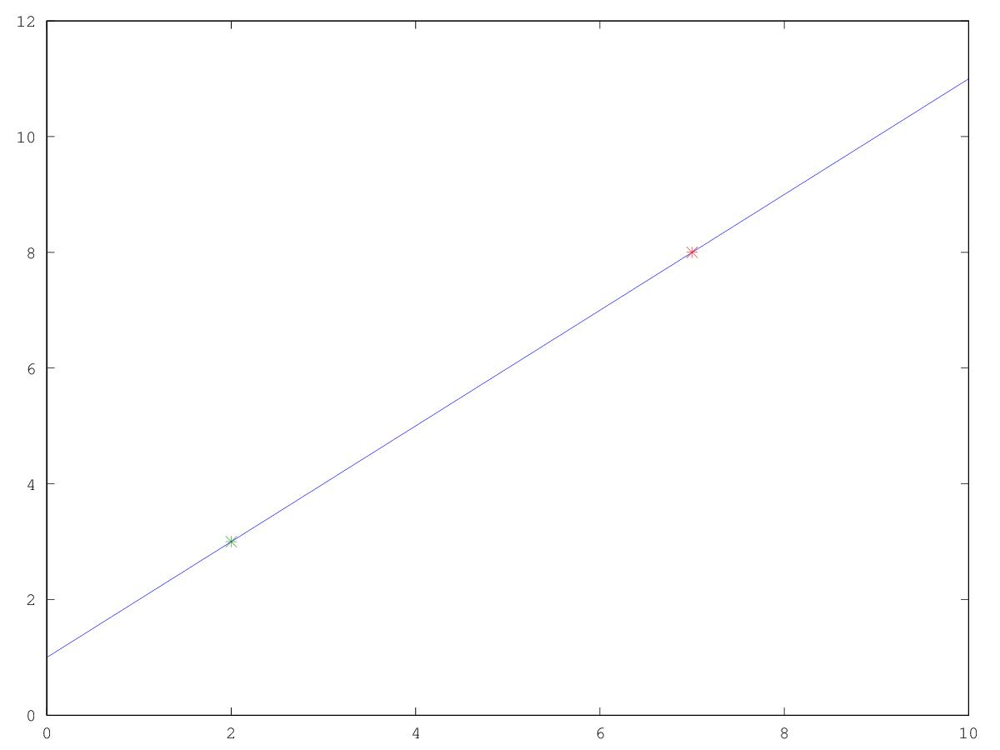
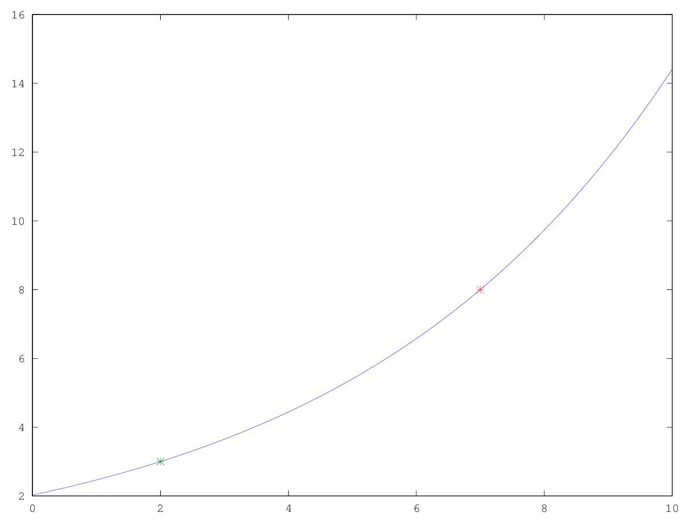
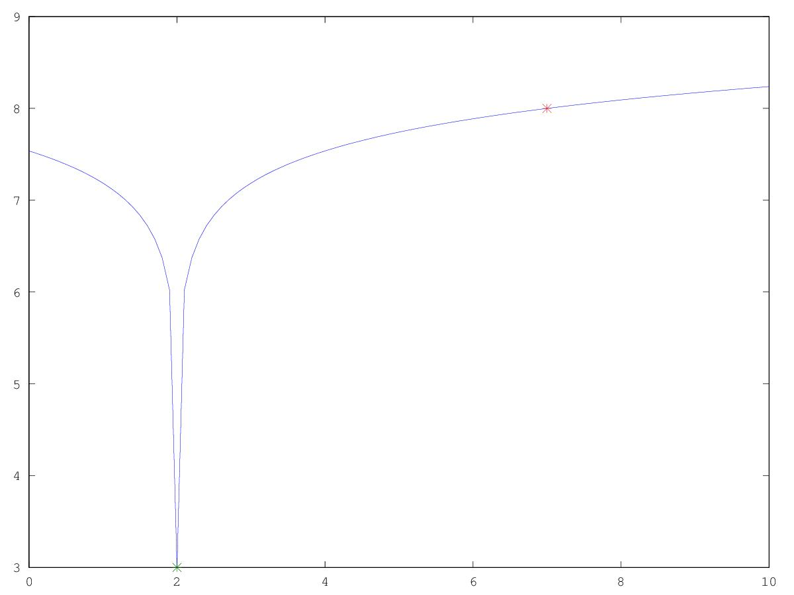

# Lezione di lunedì 23 gennaio 2017 (Matematica)





## Argomenti trattati

* revisione funzioni lineari
* funzioni esponenziali a coefficienti lineari ($y = c^{ax + b}$)
* funzioni logaritimche a coefficienti lineari ($y = log_c \( ax + b \)$)

## Realizzazioni fatte in classe

* funzioni lineari (`linea.m`):

```octave
p0=[2 3 ];
p1=[7 8];
x=[0:0.1:10];
a=(p0(2)-p1(2))/(p0(1)-p1(1));
b=(p0(2)-a*p0(1));
y=a*x+b;
plot(x,y,p0(1),p0(2),"*",p1(1),p1(2),"*")
```



* funzioni esponenziali (`espo.m`):

```octave
c=7.23;
cb=1/log(c);     % cambio base
p0=[2 3 ];
p1=[7 8];
x=[0:0.1:10];
a=(cb*log(p0(2))-cb*log(p1(2)))/(p0(1)-p1(1));
b=(cb*log(p0(2))-a*p0(1));
y=c.^(a*x+b);
plot(x,y,p0(1),p0(2),"*",p1(1),p1(2),"*")
```



* funzioni logaritmiche (`loga.m`):

```octave
c=7.23;
cb=1/log(c);     % cambio base
p0=[2 3 ];
p1=[7 8];
x=[0:0.1:10];
a=(c^(p0(2))-c^(p1(2)))/(p0(1)-p1(1));
b=(c^(p0(2))-a*p0(1));
y=cb*log(a*x+b);
plot(x,y,p0(1),p0(2),"*",p1(1),p1(2),"*")
```



## Compiti

* Trovare i coefficienti per le funzioni lineari, esponenziali e logaritmiche che passino dai seguenti
  punti (verificare con `octave`):
  * Es.1 $x_0 = -18, y_0 = 36; x_1 = 251, y_1 = 0.5;$
  * Es.2 $x_0 = -0.05, y_0 = 1049; x_1 = 1049, y_1 = -0.05;$
  * Es.3 $x_0 = 400, y_0 = 70.4; x_1 = 23, y_1 = 47;$
