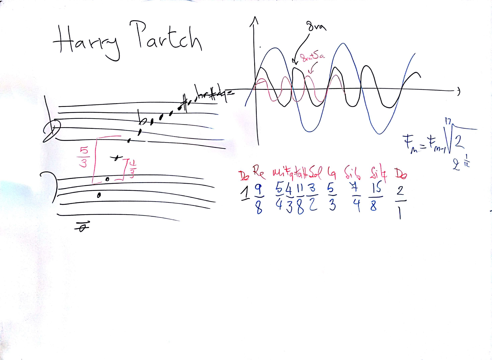

# Lezione di giovedì 16 febbraio 2017 (TCMC)

## Argomenti Trattati

* [slides](http://www.slideshare.net/NicolaBernardini2/tecniche-compositive-della-musica-contemporanea) 46-49: microtonalità - modi a trasposizione limitata
* molteplicità di visione della microtonalità
* sistemi di accordatura e temperamento
