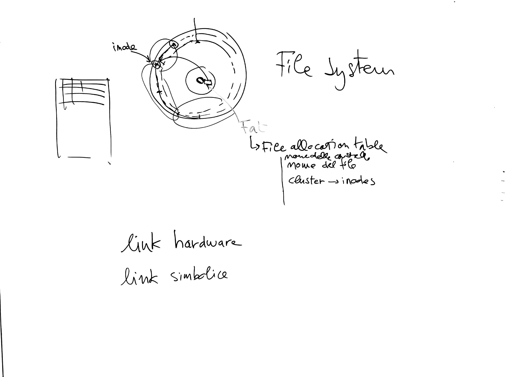

# Lezione di martedì 21 febbraio 2017 (Informatica)

## Argomenti trattati

* Organizzazione dei dischi rigidi
  * formattazione
  * cilindri e settori
  * *FAT* (*File allocation table*)
  * *inodes*, *clusters*
  * allocazione e frammentazione
  * nomi dei files
  * *link hardware*
  * *link simbolici*
