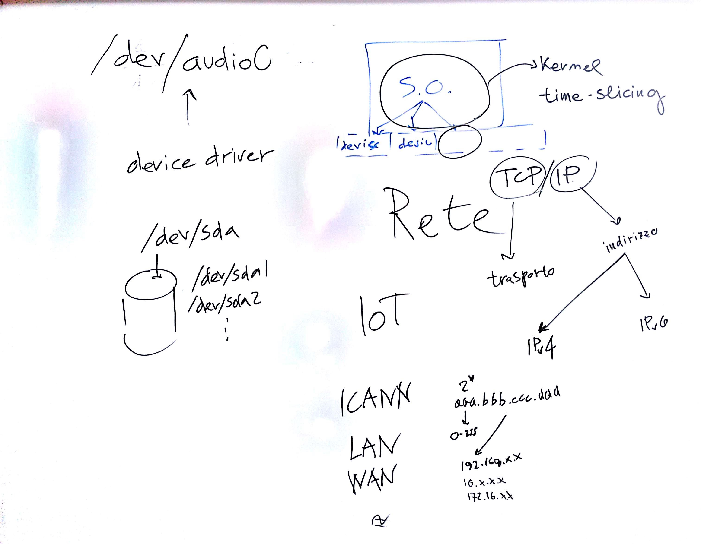

# Lezione di martedì 7 marzo 2017 (Informatica)

## Argomenti trattati

* Sistema operativo:
  * device drivers

* Reti informatiche:
  * indirizzamento `IP` (`IPv4`, accenno a `IPv6`)
  * trasporto `TCP`
  * Architetture di rete
    * Introduzione alle architetture client/server
