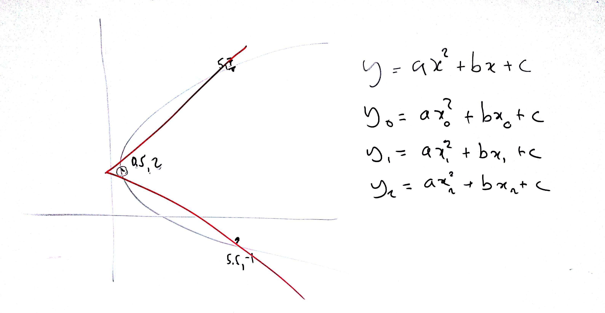

# Lezione di lunedì 20 marzo 2017 (Matematica)

## Argomenti trattati

* Ripasso delle operazioni con i logaritmi (cambio base, ecc.)
* Ripasso delle operazioni su potenze
* Come far passare una funzione parabolica da tre punti
  * funzione `polyfit` (`octave`), da verificare 

## Compito a casa

* verificare il passaggio dei parametri della funzione `polyfit`
