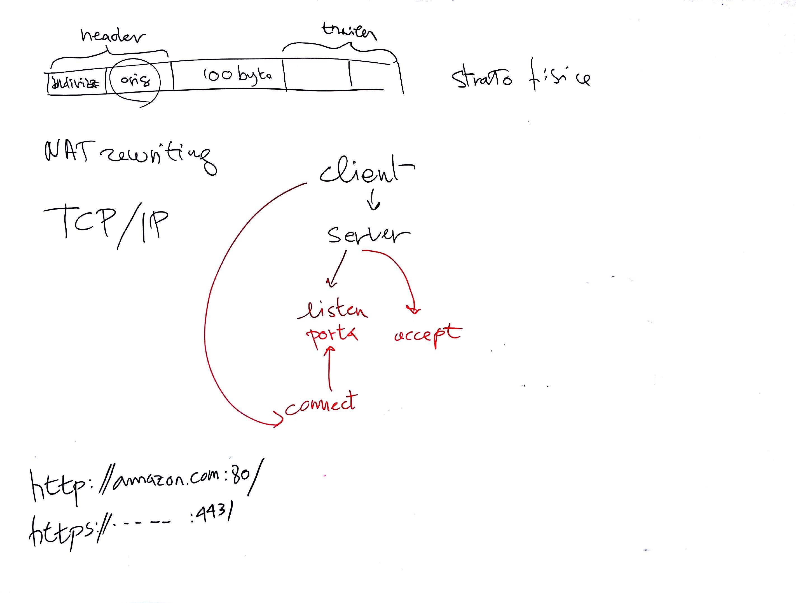

# Lezione di martedì 21 marzo 2017 (Informatica)

## Argomenti trattati

* Reti informatiche:
  * pacchettizzazione
  * layer fisico
* Architetture *client/server*:
  * `clienti`
  * `servizi`
  * porte standard
