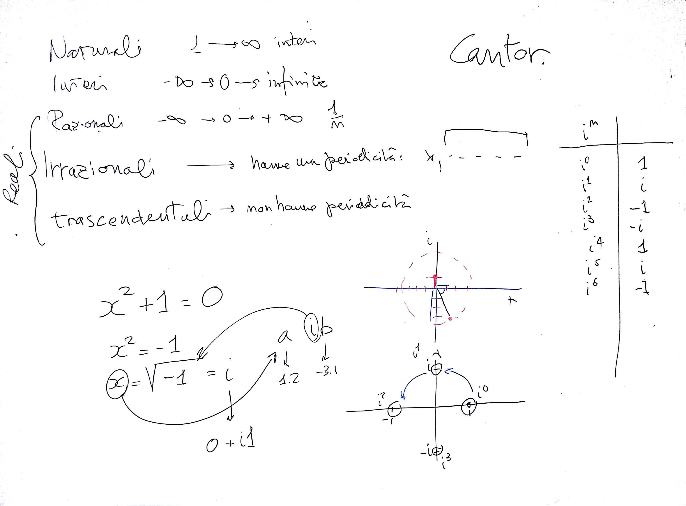

# Lezione di lunedì 24 aprile 2017 (Matematica)

## Argomenti trattati

* Introduzione ai numeri complessi:
  * Elenco degli insiemi numerici:
    * numeri *naturali*
    * numeri *interi*
    * numeri *razionali*
    * numeri *irrazionali*
    * numeri *trascendentali*
  * come si può risolvere con uno di questi insiemi l'equazione $x^2 + 1 = 0$?
    non si può. È necessario introdurre un nuovo insieme di numeri (che
    inglobi i precedenti al suo interno)
  * i numeri complessi:
    * il numero immaginario puro $i = \sqrt(-1)$
    * implicazioni: $i^0 = 1$, $i^1 = i$, $i^2 = -1$, $i^3 = -i$, $i^4 = 1$, ...:
      l'elevazione a potenza di $i$ produce un risultato ciclico!
    * se si usano potenze frazionarie si può constatare che i risultati si
      dispongono in circolo, il che significa che:
      * la parte reale è equivalente a $\cos(\alpha)$
      * la parte immaginaria è equivalente a $\sin(\alpha)$
